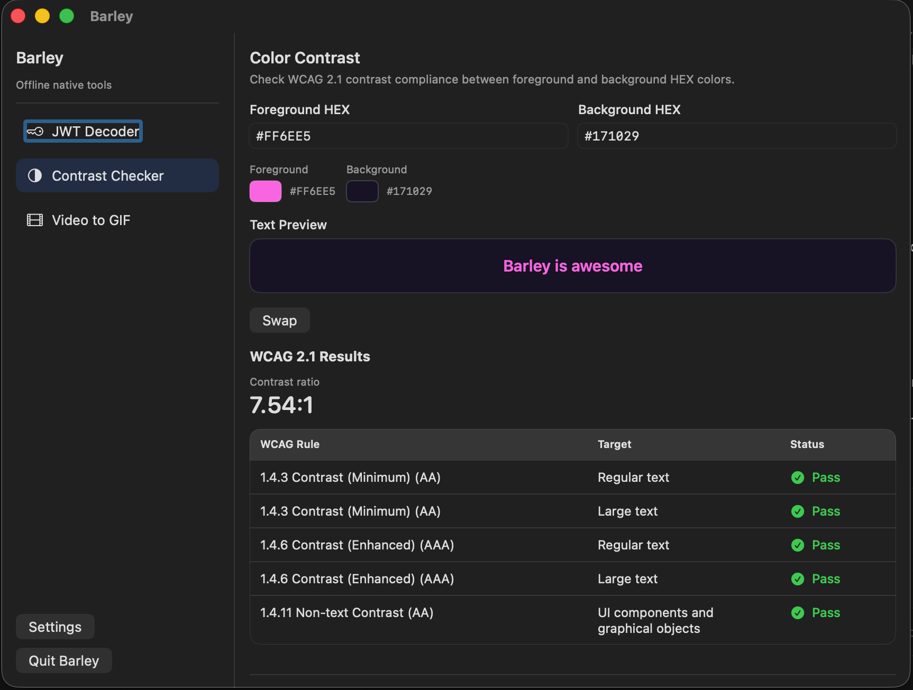

# Barley

Barley is a native macOS utility app for day-to-day developer tasks.  
It runs as a real app window and also exposes a menu bar item for fast feature selection.



## Current Features

- JWT Decoder
  - Decode JWT header and payload locally
  - Search flattened claims by key/value
  - No signature verification yet
- WCAG Contrast Checker
  - Check foreground/background HEX combinations
  - Reports AA/AAA results for common WCAG criteria
- Video to GIF
  - Convert `.mov`/`.mp4` to GIF locally
  - Select FPS and output scale
  - Uses `ffmpeg` by default for consistent output, with native fallback
  - Keeps a recent output list with per-file `Reveal in Finder`

## App Behavior

- Main window app: `Barley` opens as a normal, focusable macOS window.
- Menu bar launcher: selecting a feature from the menu bar opens/focuses the window with that feature active.
- Offline-first: conversion and analysis run locally; app features do not depend on cloud services.

## Tech Stack

- Swift 6
- SwiftUI + AppKit (macOS app APIs)
- Swift Package Manager
- Unit tests with Swift Testing

## Project Layout

```text
Package.swift
Sources/Barley/
  BarleyApp.swift
  Core/
    JWTDecoder.swift
    JSONValue.swift
  Features/
    Contrast/
      ContrastAnalyzer.swift
    JWT/
      JWTClaimSearcher.swift
      JWTWorkbenchViewModel.swift
    VideoGIF/
      VideoToGIFConverter.swift
  UI/
    ContentView.swift
    Features/
      ContrastFeatureView.swift
      JWTFeatureView.swift
      VideoToGIFFeatureView.swift
    SettingsView.swift
Tests/BarleyTests/
  ContrastAnalyzerTests.swift
  JWTDecoderTests.swift
  VideoToGIFConverterTests.swift
```

## Prerequisites

1. macOS 13+
2. Xcode 16+ (or compatible Swift 6 toolchain)
3. Command line tools installed (`xcode-select --install`)

Optional:
- `ffmpeg` via Homebrew for the default Video-to-GIF engine

## Start Developing

### 1. Clone and enter the project

```bash
git clone https://github.com/eggei/barley.git
cd barley
```

### 2. Build

```bash
swift build
```

### 3. Run tests

```bash
swift test
```

### 4. Run the app

```bash
swift run
```

### 5. Open in Xcode (recommended for UI iteration)

```bash
open Package.swift
```

Then run the `Barley` scheme.

## Development Notes

- Main app entry and scene wiring: `Sources/Barley/BarleyApp.swift`
- Feature selection shell and sidebar: `Sources/Barley/UI/ContentView.swift`
- Keep business logic in `Core/` or `Features/*` and keep SwiftUI views thin.
- Add tests in `Tests/BarleyTests/` when introducing new behavior.

## License

No license file is currently included. Add one before public reuse/distribution.
